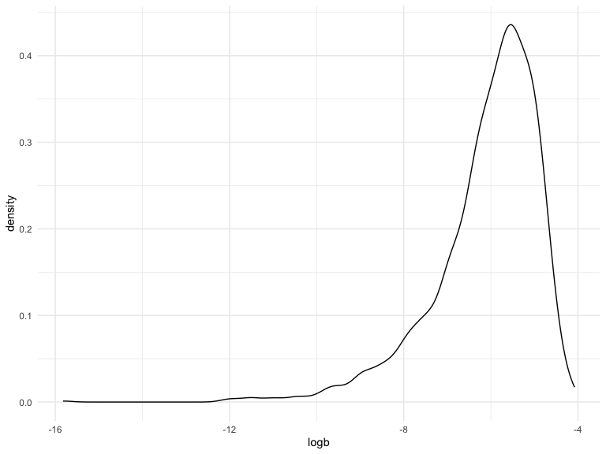

p8105_hw6_tl3195
================
Tingyi Li
2023-12-01

# Problem 2

\*Import the dataset

``` r
weather_df = 
  rnoaa::meteo_pull_monitors(
    c("USW00094728"),
    var = c("PRCP", "TMIN", "TMAX"), 
    date_min = "2022-01-01",
    date_max = "2022-12-31") |>
  mutate(
    name = recode(id, USW00094728 = "CentralPark_NY"),
    tmin = tmin / 10,
    tmax = tmax / 10) |>
  select(name, id, everything())
```

    ## using cached file: /Users/duoduoli/Library/Caches/org.R-project.R/R/rnoaa/noaa_ghcnd/USW00094728.dly

    ## date created (size, mb): 2023-12-01 18:34:41.515891 (8.544)

    ## file min/max dates: 1869-01-01 / 2023-11-30

\*A simple linear regression with tmax as the response with tmin and
prcp as the predictors

``` r
boot_sample = function(df) {
  sample_frac(df, replace = TRUE)
}

boot_straps = 
  tibble(strap_number = 1:5000) |> 
  mutate(
    strap_sample = map(strap_number, \(i) boot_sample(df = weather_df)),
    models = map(strap_sample, \(df) lm(tmax ~ tmin + prcp, data=df)),
    r_squared = map(models, broom::glance),
    results = map(models, broom::tidy)
  )|>
  select(strap_number, r_squared, results)|>
  unnest(r_squared, results)|>
  select(strap_number, r.squared, term, estimate)|>
  pivot_wider(
    names_from = term,
    values_from = estimate
  )|>
  janitor::clean_names()|>
  mutate(
    logb = log(prcp * tmin)
  )|>
  select(strap_number, r_squared, logb)
```

\*Plot the distribution of r_squared

``` r
boot_straps|>
  ggplot(aes(x = r_squared)) +
  geom_density()
```


\*Plot the distribution of logb

``` r
boot_straps|>
  filter(!is.na(logb))|>
  ggplot(aes(x = logb)) +
  geom_density()
```



The first plot shows the distribution of the r-squared values from the
data, it peaks at around 0.91. The second plot shows the distribution of
log(b1\*b2) from the data, it peaks at around -5.5. Both the plots are
left-skewed but the first plot appears slightly skewed to the left.

\*95% CI for r_squared and logb

``` r
boot_straps|>
  filter(!is.na(logb))|>
  pivot_longer(
    r_squared:logb,
    names_to = "term",
    values_to = "estimate"
  )|>
  group_by(term)|>
  summarize(
    ci_lower = quantile(estimate, 0.025),
    ci_upper = quantile(estimate, 0.975)
  )|>
  knitr::kable(digits = 3)
```

| term      | ci_lower | ci_upper |
|:----------|---------:|---------:|
| logb      |   -9.134 |   -4.576 |
| r_squared |    0.882 |    0.927 |

\#Problem 3

\*Load and clean the data for regression analysis

``` r
birth_weight = read_csv("./data/birthweight.csv")|>
  janitor::clean_names()|>
  mutate(
    babysex = as.factor(babysex),
    babysex = recode(babysex, `1` = "male", `2` = "female"),
    frace = as.factor(frace),
    frace = recode(frace, `1` = "White", `2` = "Black", `3` = "Asian", `4` = "Puerto Rican", 
                   `8` = "Other", `9` = "Unknown"),
    mrace = as.factor(mrace),
    mrace = recode(mrace, `1` = "White", `2` = "Black", `3` = "Asian", `4` = "Puerto Rican", 
                   `8` = "Other"),
    malform = as.factor(malform),
    malform = recode(malform, `0` = "absent", `1` = "present"),
  )
```

    ## Rows: 4342 Columns: 20
    ## ── Column specification ────────────────────────────────────────────────────────
    ## Delimiter: ","
    ## dbl (20): babysex, bhead, blength, bwt, delwt, fincome, frace, gaweeks, malf...
    ## 
    ## ℹ Use `spec()` to retrieve the full column specification for this data.
    ## ℹ Specify the column types or set `show_col_types = FALSE` to quiet this message.

\*Selecting Variables

``` r
full_model = lm(bwt  ~., data = birth_weight)

step(full_model, direction = 'backward', trace = FALSE)
```

    ## 
    ## Call:
    ## lm(formula = bwt ~ babysex + bhead + blength + delwt + fincome + 
    ##     gaweeks + mheight + mrace + parity + ppwt + smoken, data = birth_weight)
    ## 
    ## Coefficients:
    ##       (Intercept)      babysexfemale              bhead            blength  
    ##         -6098.822             28.558            130.777             74.947  
    ##             delwt            fincome            gaweeks            mheight  
    ##             4.107              0.318             11.592              6.594  
    ##        mraceBlack         mraceAsian  mracePuerto Rican             parity  
    ##          -138.792            -74.887           -100.678             96.305  
    ##              ppwt             smoken  
    ##            -2.676             -4.843

When selecting variables, I use the backward selection method, which
start with the full model and remove the least significant variables.

Therefore, the final model should be:

``` r
final_model = lm(formula = bwt ~ babysex + bhead + blength + delwt + fincome + gaweeks + mheight + mrace + parity + ppwt + smoken, data = birth_weight)

birth_weight|>
  add_predictions(final_model)|>
  add_residuals(final_model)|>
  ggplot(aes(x = pred, y = resid)) + 
  geom_point() + 
  labs(
    title = "Residuals vs Fitted values",
    x = "Fitted values",
    y = "Residuals"
  )
```


Compare your model to two others:

One using length at birth and gestational age as predictors (main
effects only) One using head circumference, length, sex, and all
interactions (including the three-way interaction) between these

``` r
cv_df = 
  crossv_mc(birth_weight, 100) |>
  mutate(
    maineffect_model = map(train, ~lm(bwt ~ blength + gaweeks, data = .x)),
    complex_model =  map(train, ~lm(bwt ~ bhead * blength * babysex, data = .x)),
    final_model = map(train, ~lm(bwt ~ babysex + bhead + blength + delwt + fincome + gaweeks + 
                         mheight + mrace + parity + ppwt + smoken, data = .x))
    )|>
  mutate(
    rmse_maineffect = map2_dbl(maineffect_model, test, rmse),
    rmse_complex = map2_dbl(complex_model, test, rmse),
    rmse_final = map2_dbl(final_model, test, rmse)
    ) 
```

``` r
cv_df|>
  select(starts_with("rmse"))|>
  pivot_longer(
    everything(),
    names_to = "model", 
    values_to = "rmse",
    names_prefix = "rmse_")|>
  mutate(model = fct_inorder(model))|>
  ggplot(aes(x = model, y = rmse)) + geom_violin()
```


