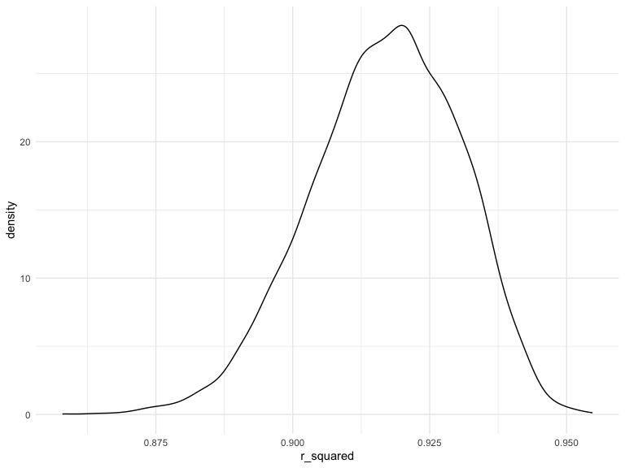

p8105_hw6_tl3195
================
Tingyi Li
2023-12-01

# Problem 2

\*Import the dataset

``` r
weather_df = 
  rnoaa::meteo_pull_monitors(
    c("USW00094728"),
    var = c("PRCP", "TMIN", "TMAX"), 
    date_min = "2022-01-01",
    date_max = "2022-12-31") |>
  mutate(
    name = recode(id, USW00094728 = "CentralPark_NY"),
    tmin = tmin / 10,
    tmax = tmax / 10) |>
  select(name, id, everything())
```

    ## using cached file: /Users/duoduoli/Library/Caches/org.R-project.R/R/rnoaa/noaa_ghcnd/USW00094728.dly

    ## date created (size, mb): 2023-12-01 18:34:41.515891 (8.544)

    ## file min/max dates: 1869-01-01 / 2023-11-30

\*A simple linear regression with tmax as the response with tmin and
prcp as the predictors

``` r
boot_sample = function(df) {
  sample_frac(df, replace = TRUE)
}

boot_straps = 
  tibble(strap_number = 1:5000) |> 
  mutate(
    strap_sample = map(strap_number, \(i) boot_sample(df = weather_df)),
    models = map(strap_sample, \(df) lm(tmax ~ tmin + prcp, data=df)),
    r_squared = map(models, broom::glance),
    results = map(models, broom::tidy)
  )|>
  select(strap_number, r_squared, results)|>
  unnest(r_squared, results)|>
  select(strap_number, r.squared, term, estimate)|>
  pivot_wider(
    names_from = term,
    values_from = estimate
  )|>
  janitor::clean_names()|>
  mutate(
    logb = log(prcp * tmin)
  )|>
  select(strap_number, r_squared, logb)
```

\*Plot the distribution of r_squared

``` r
boot_straps|>
  ggplot(aes(x = r_squared)) +
  geom_density()
```



\*Plot the distribution of logb

``` r
boot_straps|>
  filter(!is.na(logb))|>
  ggplot(aes(x = logb)) +
  geom_density()
```


The first plot shows the distribution of the r-squared values from the
data, it peaks at around 0.91. The second plot shows the distribution of
log(b1\*b2) from the data, it peaks at around -5.5. Both the plots are
left-skewed but the first plot appears slightly skewed to the left.

\*95% CI for r_squared and logb

``` r
boot_straps|>
  filter(!is.na(logb))|>
  pivot_longer(
    r_squared:logb,
    names_to = "term",
    values_to = "estimate"
  )|>
  group_by(term)|>
  summarize(
    ci_lower = quantile(estimate, 0.025),
    ci_upper = quantile(estimate, 0.075)
  )|>
  knitr::kable(digits = 3)
```

| term      | ci_lower | ci_upper |
|:----------|---------:|---------:|
| logb      |   -8.949 |   -7.924 |
| r_squared |    0.881 |    0.889 |
